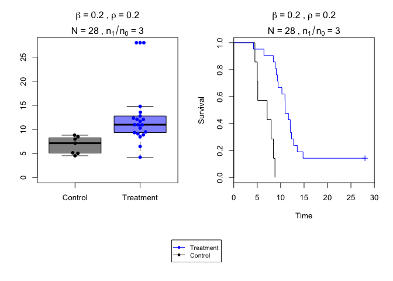
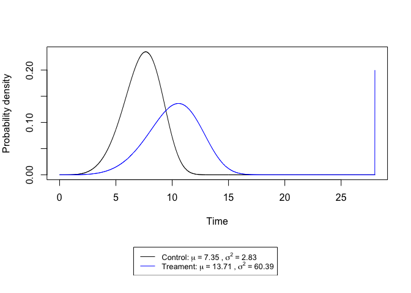
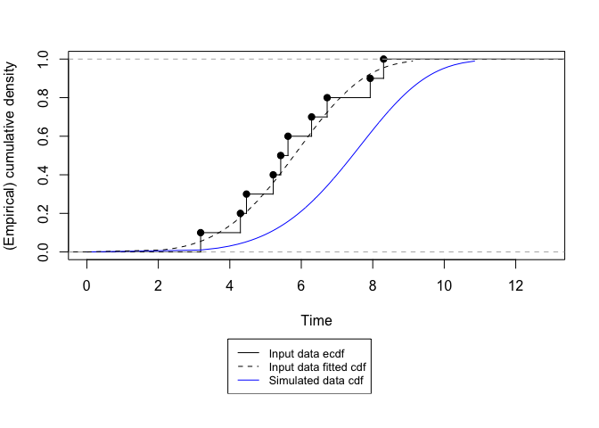

README
================
Xiaowen Tian
7/22/2019

CHMIpower
=========

<!-- badges: start -->
<!-- badges: end -->
The goal of CHMIpower is to perform power calculation for designs of Controlled Human Malaria Infection studies.

Installation
------------

You can install the released version of CHMIpower from <https://github.com/tianxiaowen/CHMI/blob/master/CHMIpower_0.0.0.9000.tar.gz>.

Please install package dependencies first.

``` r
packages <- c("survival","beeswarm","MASS","stats","graphics","grDevices")
if (length(setdiff(packages, rownames(installed.packages()))) > 0) {
  install.packages(setdiff(packages, rownames(installed.packages())))  
}
install.packages("pathname/CHMIpower_0.0.0.9000.tar.gz", repos = NULL, type = "source")
```

General setup
-------------

The Weibull distribution with shape parameter *k* and scale parameter *λ* has density given by *f(x;k,\lambda) = \frac{k}{\lambda}(\frac{x}{\lambda})^{k-1}e^{-(x/\lambda)^k}* for *x* &gt; 0. The hazard function is given by *h(x;k,\lambda)=\frac{k}{\lambda}(\frac{x}{\lambda})^{k-1}*. In our simulation studies, time to infection for control group is modeled by *W**e**i**b**u**l**l*(*k*, *λ*<sub>0</sub>). Individuals in the treament group have probability *ρ* being fully protected and their observations are set to be censored. Time to infection for the individuals in the treatment group who don't get full protection from the vaccine will follow *W**e**i**b**u**l**l*(*k*, *λ*<sub>1</sub>). Note that the shape parameter *k* for the Weibull distribution is same for the control and treatment group. Hence the hazard ratio *β* between treatment and control group is constant and has the form of $(\\frac{\\lambda\_0}{\\lambda\_1})^k$.

Example
-------

This is a basic example which shows you how to solve a common problem:

``` r
library(CHMIpower)
## Power calculation for t-test, Wilconxon test, log-rank test, Lachenbruch test, and likelihood ratio test for mixture models.
powercal(beta=0.2,lambda0=8,k=5,rho=0.2,N=16,ratio=3,endstudy=28,testname=c('t-test','logrank'),alpha=0.05,seed=1)
```

    ##  t-test logrank 
    ##   0.819   0.868

``` r
## This function visualize a simulated dataset using a boxplot and a Kaplan-Meier curve.
simexample(beta=0.2,lambda0=8,k=5,rho=0.2,N=28,ratio=3,endstudy=28,seed=1)
```



``` r
## Comparison of probability density function for simulated treatment and control group.
pdfsim(beta=0.2,lambda0=8,k=5,rho=0.2,endstudy=28)
```



``` r
## Comparison of input data to a Weibull distribution
## Maximum-likelihood fitting of input dataset to a Weibull distribution
cdfweibull(rweibull(10,3,6),lambda=8,k=5)
```



    ##      shape       scale  
    ##   4.1772734   6.3295054 
    ##  (1.0272170) (0.5065476)
